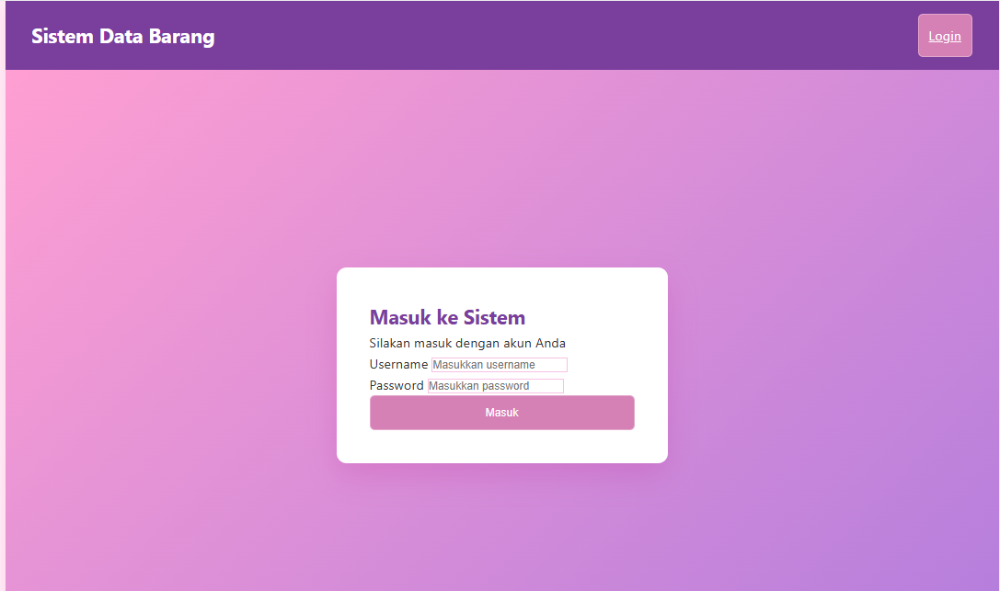

# NAMA: Nurul fadilah
# NIM: 312410689
# KELAS: TI.24.A.3

# PROJECT — Aplikasi PHP Modular
Aplikasi ini merupakan sistem berbasis PHP dengan arsitektur *Modular*, di mana setiap fitur dipisahkan ke dalam folder modul tersendiri.  
Struktur seperti ini membuat proyek lebih terorganisir, mudah dikelola, dan fleksibel untuk dikembangkan.

## Penjelasan Folder

##  assets/
Menyimpan file pendukung seperti:
- CSS (desain tampilan)
- Gambar produk
- File statis lainnya

##  config/
Berisi file konfigurasi:
- database.php → mengatur koneksi MySQL ke aplikasi
- session.php → mengecek apakah user sudah login atau belum

##  modules/
Folder utama yang menyimpan fitur-fitur aplikasi.

Contoh:
- modules/auth/ → fitur login & logout  
- modules/user/ → fitur CRUD user  

Setiap modul memiliki file terpisah agar lebih rapi.

##  views/
Berisi file tampilan umum yang dipakai banyak halaman, seperti:
- Header
- Footer
- Dashboard

##  index.php
Gerbang utama aplikasi yang meng-handle routing menggunakan $_GET['page'].

## Sistem Data Barang (Inventory Management System)
Sistem Data Barang adalah aplikasi web untuk mengelola inventory barang dengan fitur autentikasi pengguna dan manajemen data barang yang lengkap.

##  Fitur Utama

##  Sistem Autentikasi
*Login Page* 

- Form login dengan username dan password
- Validasi akses pengguna
- Tampilan profesional dengan header dan navigasi

##  Dashboard
*Dashboard* 

">
- Statistik ringkasan inventory
- Total Barang: 15 item
- Kategori: 3 kategori
- Stok Total: 125 unit
- Welcome message dengan nama pengguna
- Quick actions: Lihat Data Barang & Tambah Barang

##  Manajemen Data Barang
*Data Barang* 

">
- Tabel daftar barang dengan kolom lengkap:
- Nama Barang
- Kategori
- Harga Jual
- Harga Beli
- Stok
- Aksi (Edit & Hapus)
- Tombol "Tambah Barang" untuk navigasi cepat

##  Tambah Barang
*Form Tambah Barang* 

">
- Input data barang baru:
- Nama Barang (text input)
- Kategori (dropdown/select)
- Harga Jual (numeric input)
- Harga Beli (numeric input)
- Stok (numeric input)
- Tombol aksi: Simpan Barang & Batal
